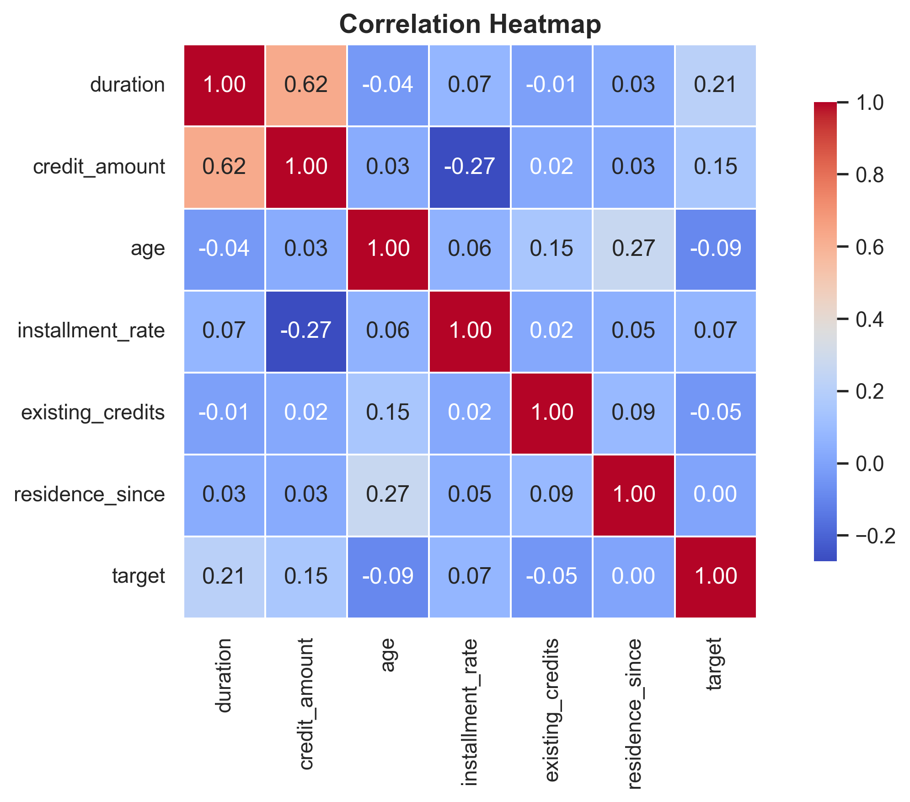
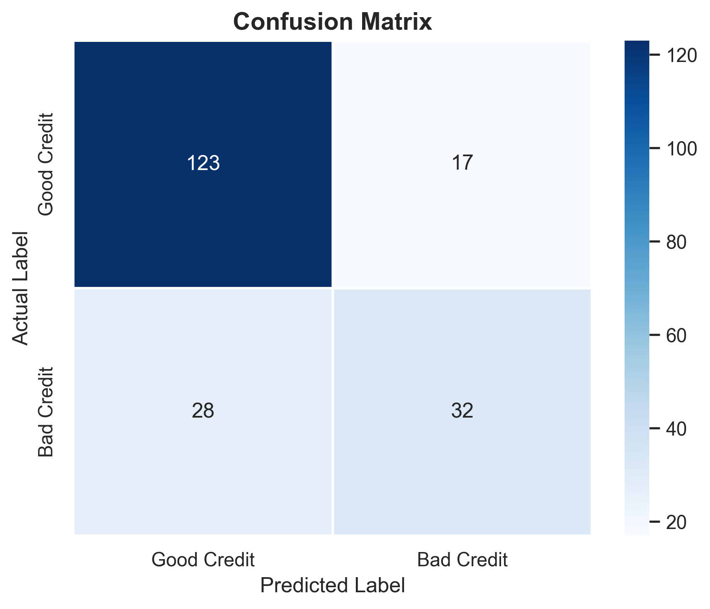

# 🏦 Loan Approval Prediction using Machine Learning

> Binary classification model to predict credit risk using Logistic Regression on the Statlog German Credit Dataset.

---

⭐ If you like this project, consider giving it a star!


## 📌 Project Overview

| Item | Detail |
|------|--------|
| **Dataset** | Statlog German Credit Data — UCI Machine Learning Repository |
| **Records** | 1000 loan applicants |
| **Features Used** | 10 (9 input + 1 target) |
| **Algorithm** | Logistic Regression |
| **Train/Test Split** | 80% / 20% |
| **Testing Accuracy** | 77.58% |

---

## 📁 Project Structure

```
loan-approval-prediction/
│
├── loan_prediction.ipynb              # Main Jupyter Notebook (ML pipeline)
├── loan_approval_prediction.pdf       # Research paper documentation
│
├── model/
│   └── loan_model.pkl                # Saved trained model
│
├── outputs/
│   └── plots/
│       ├── countplot.png             # Class distribution
│       ├── histograms.png            # Feature distributions
│       ├── boxplots.png              # Feature vs Loan Outcome
│       ├── heatmap.png               # Correlation heatmap
│       └── confusion_matrix.png      # Model evaluation
│
├── README.md                         # Project documentation
├── LICENSE                           # MIT License
├── .gitignore                        # Ignore unnecessary files

```

---

## 📊 Dataset

- **Source:** [UCI Machine Learning Repository](https://archive.ics.uci.edu/ml/datasets/statlog+(german+credit+data))
- **Loaded directly** from UCI URL — no manual download needed

### Selected Features

| Feature | Type | Description |
|---------|------|-------------|
| `duration` | Numerical | Loan duration in months |
| `credit_amount` | Numerical | Amount of credit in Deutsche Marks |
| `installment_rate` | Numerical | Installment rate as % of income |
| `residence_since` | Numerical | Years at current residence |
| `age` | Numerical | Age of applicant |
| `existing_credits` | Numerical | Number of existing credits at bank |
| `checking_account` | Categorical | Status of checking account |
| `credit_history` | Categorical | Past credit history |
| `purpose` | Categorical | Purpose of the loan |
| `target` | Binary | 0 = Good Credit, 1 = Bad Credit |

---

## ⚙️ ML Pipeline

```
Data Loading → EDA → Visualization → Data Cleaning → Preprocessing → Model Training → Evaluation
```

1. **Data Loading** — Fetched directly from UCI Repository
2. **EDA** — Shape, dtypes, describe, missing values, class distribution
3. **Visualization** — Countplot, Histograms, Boxplots, Heatmap
4. **Data Cleaning** — Removed nulls and duplicates
5. **Preprocessing** — LabelEncoder (categorical) + StandardScaler (numerical)
6. **Model** — Logistic Regression (`random_state=42`, `max_iter=1000`)
7. **Evaluation** — Accuracy, Precision, Recall, F1, Confusion Matrix

---

## 📈 Results

| Metric | Score |
|--------|-------|
| Training Accuracy | 74.75% |
| Testing Accuracy | **77.58%** |
| Precision | 65.31% |
| Recall | 53.33% |
| F1 Score | 58.72% |

### Classification Report

| Class | Precision | Recall | F1-Score | Support |
|-------|-----------|--------|----------|---------|
| Good Credit | 0.81 | 0.88 | 0.85 | 140 |
| Bad Credit | 0.65 | 0.53 | 0.59 | 60 |

### Confusion Matrix

| | Predicted Good | Predicted Bad |
|--|--|--|
| **Actual Good** | 123 | 17 |
| **Actual Bad** | 28 | 32 |

---

## 📉 Visualizations

| Plot | Description |
|------|-------------|
|  | Correlation between features |
|  | Model prediction results |

---

## 🛠️ Tech Stack


---

## 🚀 How to Run

```bash
# 1. Clone the repository
git clone https://github.com/abhii026/loan-approval-prediction.git

# 2. Navigate into the folder
cd loan-approval-prediction

# 3. Install required libraries
pip install numpy pandas matplotlib seaborn scikit-learn

# 4. Open the Jupyter Notebook
jupyter notebook loan_prediction.ipynb
```

> ✅ No dataset download needed — data is fetched directly from UCI in the notebook.

---

## 🔮 Future Scope

- [ ] Try ensemble models — Random Forest, XGBoost, Gradient Boosting
- [ ] Handle class imbalance using **SMOTE**
- [ ] Deploy as a web app using **Flask** or **Streamlit**
- [ ] Add cross-validation and hyperparameter tuning

---

## 👤 Author

**Abhishek Singh**   
B.Tech CSE | 2026  
📧Connect on [LinkedIn](https://www.linkedin.com/in/abhii026/)

---

## 📄 License

This project is open source and available under the [MIT License](LICENSE).
